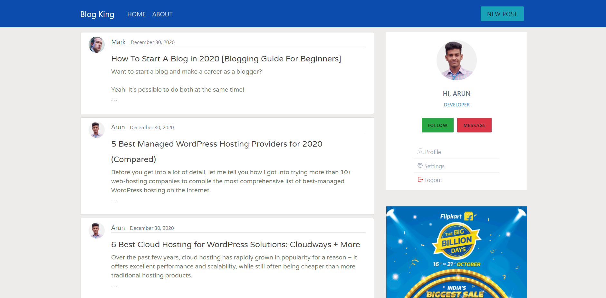
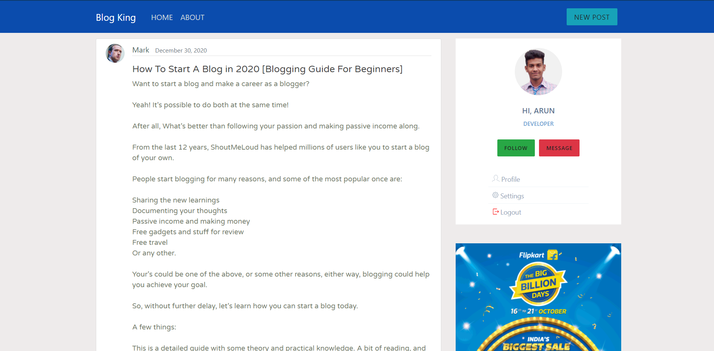
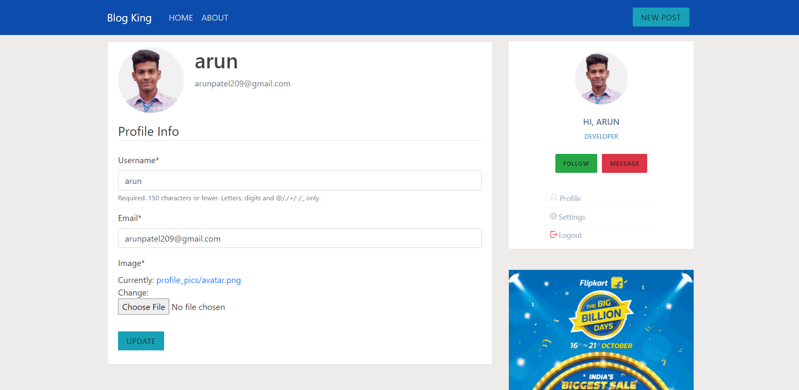
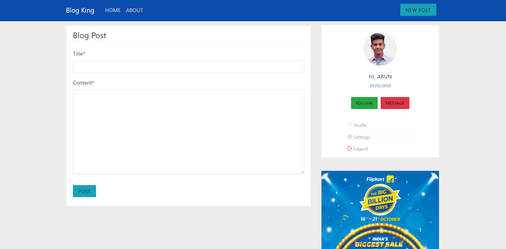

# CMS-Python
Authentication System
CRUD implementation on Blog
CRUD implementation on User Profile

### Content Management System - Django

An CMS web app built with **Django Framework**. 
Features of this this project are:
* Authentication (Signup/Login/Forget Password)
* Edit Profile, Upload Profile Image
* Showing Dynamic Blog List and Blog Details.
* We can Update and Delete Blog Post

Home Screen (Post List)    |  Blog Details
:-------------------------:|:-------------------------:
  |  

View and Edit Profile      |  Create New Post
:-------------------------:|:-------------------------:
  |  